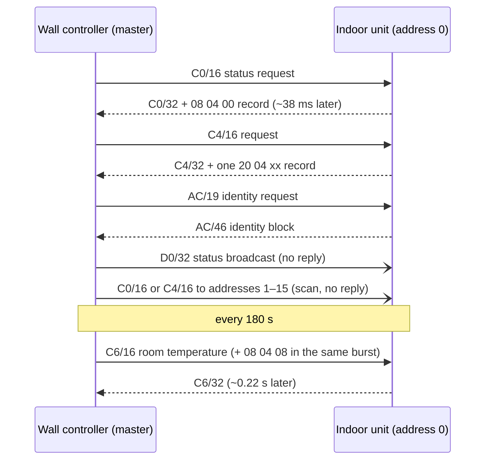

# Midea HAHB Bus Protocol

**A reverse-engineered reference for the two-wire HA/HB bus between a Midea indoor unit and its wired wall controller.**

The wall controller polls the indoor unit (IDU) with Midea XYE-style frames sent as HBS-style AMI pulses. The IDU answers each poll, and through those answers it also re-broadcasts almost the entire outdoor-unit telemetry it receives over S1S2. This repository documents the bus from the wire up to every byte.

> [!NOTE]
> Unofficial and not affiliated with Midea. Everything here was measured on one system (below). Each field carries a confidence tag. Treat anything not tagged ✅ as a lead, not a fact.

> [!WARNING]
> The bus carries ~19 V DC and powers the wall controller. Listening is safe with a proper receiver. **Transmitting** onto the bus can disrupt or damage the equipment.
> 
> Frame AC/46 carries a 28-character ASCII string. Could be a unique unit identification.

---

## Contents

1. [At a glance](#at-a-glance)
2. [Physical layer](#1-physical-layer)
3. [Bits to bytes](#2-bits-to-bytes)
4. [Frame formats and integrity checks](#3-frame-formats-and-integrity-checks)
5. [Who talks when](#4-who-talks-when)
6. [Frame catalogue](#5-frame-catalogue)
7. [Field maps (every byte)](#6-field-maps)
8. [The 20 04 rotation and S1S2](#7-the-20-04-rotation-and-s1s2)
9. [Phantom frames](#8-phantom-frames)
10. [Open questions](#9-open-questions)
11. [Method, sources and confidence](#10-method-sources-and-confidence)
12. [Related projects](#related-projects)

---

## At a glance

| | |
|---|---|
| **Wires** | 2 (HA, HB), polarity-free, ~19 V DC + data |
| **Line code** | AMI: a mark = a short pulse, polarity alternates |
| **Cell time** | 41.67 µs (24,000 cells/s) |
| **Byte** | 10 cells: `0 nnnn 0 nnnn`, nibbles LSB-first |
| **Throughput ceiling** | 2,400 bytes/s |
| **Bus master** | Wall controller (300 ms slot clock) |
| **Slave** | IDU at address 0; replies ~38 ms after a request |
| **Frames** | XYE-style `AA … 55` frames + class-04 records (`len 04 subtype … CRC`) |
| **Checks** | 8-bit sum on all XYE frames; CRC-8/MAXIM on D0, AC and class-04 records |
| **Hidden bonus** | `20 04` records carry the IDU↔ODU S1S2 telemetry, one block every 33.6 s |

**Tested on:** Senville (Midea OEM) 3-ton ducted inverter heat pump, wired controller KJR-120W/MBF.

---

## 1. Physical layer

- **Two conductors**, HA and HB. They carry the ~19 V DC that powers the wall controller, with the data riding on top. Swapping them changes nothing.
- **AMI signalling**, the HBS-style scheme used by the Mitsumi MM1192 / XL1192 transceiver family. Each mark has the opposite polarity to the previous one, so the data averages to zero and never disturbs the DC supply.
- **Cell = 41.67 µs.** A mark fills about half a cell.
  - A cell **with** a mark = **0**.
  - An **empty** cell = **1**.
  - An idle line carries no marks.
- **Half duplex.** Only one device talks at a time. The wall controller decides who.

---

## 2. Bits to bytes

Every byte is a **10-cell group**: a stuffed `0`, the high nibble, a stuffed `0`, the low nibble. Each nibble is sent least-significant bit first.

```
 0  n n n n     0  n n n n
 ^  high nibble ^  low nibble      (each nibble LSB first)
 stuffed 0      stuffed 0
```

- **Why the stuffed 0:** it forces a mark at least every 5 cells, so a receiver keeps its clock through long runs of 1s.
- **Timing:** one byte takes 10 × 41.67 µs = 416.7 µs.

| Frame size | Time on the wire |
|---|---|
| 16 bytes | ≈ 6.7 ms |
| 32 bytes | ≈ 13.3 ms |
| 46 bytes | ≈ 19.2 ms |

**Worked example: `0xAA`.** Each nibble is `A` = `1010`, sent LSB first as `0101`, so the byte is `0 0101 0 0101`. On the wire that is: mark, mark, empty, mark, empty, mark, mark, empty, mark, empty, with each mark flipping polarity.

```python
def group_to_byte(cells):
    """cells: 10 ints, 0 = mark, 1 = empty, in wire order."""
    assert cells[0] == 0 and cells[5] == 0          # stuffed zeros
    hi = sum(cells[1 + i] << i for i in range(4))   # LSB first
    lo = sum(cells[6 + i] << i for i in range(4))
    return (hi << 4) | lo
```

---

## 3. Frame formats and integrity checks

A **burst** is a run of marks with idle on both sides. One talker may send several frames back to back in one burst. There are two kinds of frame.

### XYE-style frame

```
AA  cmd  b02 … b(N-3)  [CRC-8]  sum  55
```

| Part | Rule |
|---|---|
| `AA` / `55` | Start and end of every frame |
| `cmd` | Command byte: `C0`, `C3`, `C4`, `C6`, `AC` or `D0` |
| **sum** | All bytes from `b00` through the sum byte add to `0xAA` (mod 256). Equivalently sum = −(b01 + … + byte before it) mod 256. |
| **CRC-8/MAXIM** | Only on D0 and AC, placed just before the sum |
| `b02` (16-byte requests) | Destination address (0 = this IDU) |
| `b13` (16-byte requests) | `0xFF − cmd` (`3F` for C0, `3B` for C4, `39` for C6) |

### Class-04 record

No `AA` wrapper. It is never sent alone: it is appended to the end of a reply burst.

```
len  04  subtype  payload…  CRC-8/MAXIM
```

| Part | Rule |
|---|---|
| `len` | Total record length: `0x08` or `0x20` |
| `04` | Class byte |
| `subtype` | `00`–`08`, `10` |
| CRC | CRC-8/MAXIM over every byte before it |

### Checking frames in code

```python
def crc8_maxim(data):                 # poly 0x31 reflected (0x8C), init 0
    crc = 0
    for b in data:
        crc ^= b
        for _ in range(8):
            crc = (crc >> 1) ^ 0x8C if crc & 1 else crc >> 1
    return crc

def xye_ok(f):                         # AA … sum 55
    return f[0] == 0xAA and f[-1] == 0x55 and sum(f[:-1]) & 0xFF == 0xAA

def d0_ok(f):                          # D0 adds CRC-8 at b29
    return xye_ok(f) and crc8_maxim(f[:29]) == f[29]

def cls04_ok(r):                       # len 04 subtype … CRC
    return r[0] == len(r) and r[1] == 0x04 and crc8_maxim(r[:-1]) == r[-1]
```

### How strong each check is

| Frame | Protection | A random corruption passes |
|---|---|---|
| C0, C3, C4, C6, all 16-byte requests | 8-bit sum + `55` tail | ~1 in 256 |
| D0 | CRC-8 + sum | ~1 in 65,536 |
| AC/46 | inner check + CRC-8 + sum | ~1 in 16.7 M |
| Class-04 records | CRC-8 | ~1 in 256 |

> [!TIP]
> Only accept a sum-only frame at a **known length** that ends in `55`. Two bit errors that cancel in the sum create convincing phantom commands (see [Phantom frames](#8-phantom-frames)).

---

## 4. Who talks when

**The wall controller is the only device that starts a conversation.** It sends each request in its own slot of a 300 ms clock (10 ms granularity). The IDU answers about 38 ms after the request ends, and only when addressed.



*Typical exchanges, not to scale. The order of requests varies from cycle to cycle.*

| Request (wall controller) | Reply (IDU) | Repeats every |
|---|---|---|
| `D0/32` | none (broadcast) | ~1.2 s |
| `AC/19` | `AC/46` | ~1.3 s |
| `C0/16` → address 0 | `C0/32` + `08 04 00` | 1.5 s / 2.4 s, alternating |
| `C4/16` → address 0 | `C4/32` + one `20 04 xx` | 1.5 s / 2.4 s, alternating |
| `C0/16` / `C4/16` → addresses 1–15 | none | one per ~2 s; full pass 31.6 s |
| `C6/16` + `08 04 08` | `C6/32` ~0.22 s later | exactly 180 s |
| *(fan or setpoint changed)* | `C3/32` | only around a change |

- **Address scan.** b02 of the 16-byte requests is the destination. Besides its normal polls to address 0, the controller steps through addresses 1 → 15, alternating C0 and C4, and gets no answer on a single-IDU system. This suggests group control of up to 16 IDUs (inferred).
- **The 20 04 rotation** runs on the IDU's own timer and has nothing to do with the 31.6 s scan. See [section 7](#7-the-20-04-rotation-and-s1s2).

---

## 5. Frame catalogue

Temperatures in C0, C3, C4 and C6 replies: **(raw − 40) / 2 = °C**. Setpoint bytes: **raw − 135 = °F**.

| Frame | From | Carries | Checks |
|---|---|---|---|
| `D0/32` | Controller | mode, fan setting, setpoint, room temp (°C + 0.5 bit), weekday / hour / minute, gear limit, boost | CRC-8 + sum |
| `C0/16` | Controller | status request: address only | sum |
| `C0/32` | IDU | mode, actual fan level, setpoint, T1, two indoor coil temps, T3, compressor running, error and protection flags, indoor EEV | sum |
| `C3/32` | IDU | same layout as C0/32; seen only around settings changes (likely the XYE "set" reply) | sum |
| `C4/16` | Controller | request: address only | sum |
| `C4/32` | IDU | mode / fan / setpoint targets, T4 outdoor air | sum |
| `C6/16` | Controller | room temperature, whole °C (XYE "follow-me") | sum |
| `C6/32` | IDU | same layout and values as C4/32 | sum |
| `AC/19` | Controller | identity request (constant) | CRC-8 + sum |
| `AC/46` | IDU | a length-prefixed block: a 28-character ASCII string (likely model/serial) + its own check byte | inner check + CRC-8 + sum |
| `08 04 00` | IDU | rides with every C0/32; payload always zero | CRC-8 |
| `08 04 08` | ? | rides in every C6/16 burst; payload always zero | CRC-8 |
| `20 04 xx` | IDU | one telemetry block per C4/32 (see [section 7](#7-the-20-04-rotation-and-s1s2)) | CRC-8 |

---

## 6. Field maps

**Tags:** ✅ confirmed (physically verified, or an exact match to a confirmed field) · 🟰 exact (byte-for-byte or arithmetic match to another field) · 🔶 inferred (strong pattern, not verified) · ❔ unknown.

"Always X" means X in every frame counted **in cooling, low and medium fan, no faults**. Those bytes may move in heat, high fan, defrost or a fault.

<details>
<summary><b>D0/32: status broadcast</b> (controller → all)</summary>

| Byte | Meaning | Decode | Tag |
|---|---|---|---|
| b00 | `AA` | start | |
| b01 | `D0` | command | |
| b02 | `0x20` | constant; equals the frame length (32) | |
| b03 | `0x01` | constant | |
| b04 | — | always 0 | |
| b05 | mode | `0x88` = cool | ✅ |
| b06 | fan setting | `0x80` auto, `0x01` high, `0x02` med, `0x04` low | ✅ |
| b07 | setpoint | raw − 135 = °F (`0xD1` = 74 °F) | ✅ |
| b08–b12 | — | always 0 | |
| b13 | gear (capacity limit) | 0 = 100 %, 64 = 50 %, 96 = 75 % | ✅ |
| b14 | — | always 0 | |
| b15 | boost | 6 = normal, 14 = boost | ✅ |
| b16 | room temperature | whole °C (= C6/16 b11) | ✅ |
| b17 | — | always 0 | |
| b18 | weekday + hour | weekday = `(b18 >> 5) & 7` (Mon = 1 … Sun = 7); hour = `b18 & 0x1F` | ✅ |
| b19 | minute | 0–59 | ✅ |
| b20–b23 | — | always 0 | |
| b24 | room temp half-degree | 0 = .0, 1 = .5 → **temp = b16 + 0.5 × b24 °C** | ✅ |
| b25–b28 | — | always 0 | |
| b29 | CRC-8/MAXIM | over b00–b28 | |
| b30 | sum | | |
| b31 | `55` | end | |

A D0 that lost its final `55` (31 bytes) still has its CRC and sum, so it can be trusted.
</details>

<details>
<summary><b>C0/16 and C4/16: requests</b> (controller → IDU)</summary>

| Byte | C0/16 | C4/16 |
|---|---|---|
| b00 | `AA` | `AA` |
| b01 | `C0` | `C4` |
| b02 | destination address (0 = IDU, 1–15 = scan) ✅ | same ✅ |
| b03–b05 | always 0 | always 0 |
| b06 | 0 | `0xA5` |
| b07 | 0 | `0x5A` |
| b08–b12 | always 0 | always 0 |
| b13 | `0x3F` = 0xFF − cmd 🟰 | `0x3B` = 0xFF − cmd 🟰 |
| b14 | sum | sum |
| b15 | `55` | `55` |
</details>

<details>
<summary><b>C0/32: status reply</b> (IDU → controller); C3/32 uses the same layout</summary>

Temps: **(raw − 40) / 2 = °C**.

| Byte | Meaning | Decode | Tag |
|---|---|---|---|
| b00–b01 | `AA C0` | | |
| b02–b05 | — | always 0 | |
| b06 | `0x30` | constant | |
| b07 | `0x04` | constant | |
| b08 | mode | `0x88` = cool | ✅ |
| b09 | actual fan level | `0x84` low, `0x82` medium (stays set while the blower is idle) | ✅ |
| b10 | setpoint | raw − 135 = °F | ✅ |
| b11 | T1 return air | °C | ✅ |
| b12 | indoor coil (XYE "T2A") | °C; = S1S2 "T2" (IDU14), r = 1.00 | ✅ |
| b13 | indoor coil (XYE "T2B") | °C; warmest of the coil sensors | ✅ |
| b14 | T3 outdoor coil | °C | ✅ |
| b15 | `0x01` | constant (XYE current slot; not usable here) | |
| b16–b18 | — | always 0 (XYE timer slots) | |
| b19 | compressor running | 0 / 1 | ✅ |
| b20–b21 | — | always 0 | |
| b22–b23 | error flags | always 0 so far | ❔ |
| b24–b25 | protection flags | always 0 so far | ❔ |
| b26–b27 | — | always 0 | |
| b28 | indoor EEV, low byte | **EEV = b28 \| b29 << 8**, 0–480 steps | ✅ |
| b29 | indoor EEV, high byte | = S04_03 b24/b23 | 🟰 |
| b30 | sum | | |
| b31 | `55` | | |

- [HomeOps/ESPHome-Midea-XYE](https://github.com/HomeOps/ESPHome-Midea-XYE)
</details>

<details>
<summary><b>C4/32: targets reply</b> (IDU → controller); C6/32 is identical</summary>

| Byte | Meaning | Decode | Tag |
|---|---|---|---|
| b00–b01 | `AA C4` | | |
| b02–b05 | — | always 0 | |
| b06–b10 | `86 40 80 30 8C` | constant | |
| b11–b14 | — | always 0 | |
| b15 | `0x20` | constant | |
| b16 | mode target | `0x88` = cool | ✅ |
| b17 | fan target | `0x80` = auto | ✅ |
| b18 | setpoint target | raw − 135 = °F | ✅ |
| b19 | `0xBC` | constant | ❔ |
| b20 | `0xD6` | constant | ❔ |
| b21 | T4 outdoor air | (raw − 40) / 2 = °C | ✅ |
| b22–b25 | — | always 0 | |
| b26–b29 | `0x80` | constant | |
| b30 | sum | | |
| b31 | `55` | | |

- [HomeOps/ESPHome-Midea-XYE](https://github.com/HomeOps/ESPHome-Midea-XYE)
</details>

<details>
<summary><b>C6/16: room temperature push</b> (controller → IDU, every 180 s)</summary>

| Byte | Meaning | Decode | Tag |
|---|---|---|---|
| b00–b01 | `AA C6` | | |
| b02–b09 | — | always 0 | |
| b10 | `0x42` | constant (`0x46` in one older capture) | ❔ |
| b11 | room temperature | whole °C; = D0 b16 in 220 of 220 | 🟰 |
| b12 | — | always 0 | |
| b13 | `0x39` | 0xFF − cmd | 🟰 |
| b14 | sum | | |
| b15 | `55` | | |

- [HomeOps/ESPHome-Midea-XYE](https://github.com/HomeOps/ESPHome-Midea-XYE)
</details>

<details>
<summary><b>AC/19 and AC/46: identity</b></summary>

**AC/19** (controller → IDU) is constant:
`AA AC 00 00 00 00 A5 5E 13 3C 00 00 00 02 00 00 [CRC] [sum] 55`. b08 = `0x13` = frame length (19); CRC-8 at b16.

**AC/46** (IDU → controller):

| Byte | Meaning | Tag |
|---|---|---|
| b00–b01 | `AA AC` | |
| b02–b05 | always 0 | |
| b06–b07 | `A5 5E` | |
| b08 | `0x2E` = frame length (46) | |
| b09–b11 | `00 02 01` | |
| b12 | `0x1E` = 30 = length of the block b13–b42 | 🟰 |
| b13–b40 | 28 ASCII characters (likely unit identification; **unit-specific, redacted here**) | 🔶 |
| b41 | one non-ASCII data byte | |
| b42 | inner check over b13–b41 | 🟰 see note |
| b43 | CRC-8/MAXIM over b00–b42 | ✅ |
| b44 | sum | ✅ |
| b45 | `55` | |

> **Inner check note:** on the test unit, b42 equals **both** CRC-8/MAXIM(b13…b41) **and** sum(b11…b41) & 0xFF. Only one can be the real rule. Every AC/46 from one unit is identical, so an AC/46 from a **different** unit is needed to decide.
</details>

<details>
<summary><b>08 04 xx: short class-04 record</b></summary>

| Byte | Meaning |
|---|---|
| b00 | `0x08` record length |
| b01 | `0x04` class |
| b02 | `0x00` with every C0/32 · `0x08` with every C6/16 |
| b03–b06 | always 0 |
| b07 | CRC-8/MAXIM (`0x2D` for `00`, `0x13` for `08`) |
</details>

<details>
<summary><b>20 04 xx: common layout</b></summary>

| Byte | Meaning |
|---|---|
| b00 | `0x20` record length (32) |
| b01 | `0x04` class |
| b02 | subtype |
| b03–b30 | payload (below) |
| b31 | CRC-8/MAXIM over b00–b30 |

**S04_00** is constant: b06 `0x50`, b10 `0x03`, b12 `0x21`, b13 `0xFF`, b14 `0x80`, everything else 0.
**S04_01** is all zero, in every one of 2,500+ records.
</details>

<details>
<summary><b>S04_02: compressor and temperatures</b> (= S1S2 0001_20 / 0100_20)</summary>

Indoor sensors: **(raw − 30) / 2 = °C**. Outdoor sensors: **(raw − 50) / 2 = °C**. These are exact copies of the C0/C4 temperatures with a ±10 offset.

| Byte | Meaning | Decode / match | Tag |
|---|---|---|---|
| b03 | compressor actual frequency | Hz; = S1S2 ODU6 (Fr) | 🟰 |
| b04 | IDU demand frequency | Hz; = S1S2 IDU7 (oT) | 🟰 |
| b05 | mode flag | 1 normal, 3 seen briefly (possibly boost); = S1S2 ODU16 | 🟰 |
| b06 | compressor current | = S1S2 ODU12 (dL); amps scaling not meter-verified | 🟰 |
| b07–b08 | — | always 0 | |
| b09 | T1 return air | = C0 b11 − 10 | 🟰 |
| b10 | indoor coil "T2" | = C0 b12 − 10; = S1S2 IDU14 (r = 1.00) | 🟰 |
| b11 | T3 outdoor coil | = C0 b14 + 10; = S1S2 ODU9 | 🟰 |
| b12 | T4 outdoor air | = C4 b21 + 10; = S1S2 ODU10 | 🟰 |
| b13 | TP discharge | **°C directly**; matches S1S2 ODU11 within 0.3 °C | 🟰 |
| b14–b18 | — | always 0 | |
| b19 | third indoor coil sensor | (raw − 30)/2 °C; coldest of the three, reacts first at compressor start → likely refrigerant inlet; not in any C0/C4 byte | 🔶 |
| b20 | indoor coil, warmest | = C0 b13 − 10 | 🟰 |
| b21 | — | always 0 | |
| b22 | unknown | 0–7 | ❔ |
| b23–b30 | — | always 0 | |
</details>

<details>
<summary><b>S04_03: blower and indoor EEV</b> (IDU's own)</summary>

| Byte | Meaning | Decode | Tag |
|---|---|---|---|
| b03 | blower target / 8 | 183 low, 206 medium, 0 idle (= S04_10 target ÷ 8) | 🟰 |
| b04 | actual blower speed, scaled | ≈ speed / 6.7, 0–125 | 🔶 |
| b05–b10 | — | always 0 | |
| b11 | blower running | `0x40` on, `0x00` off | 🔶 |
| b12 | `0x01` | constant | |
| b13 | `0x03` | constant | |
| b14–b22 | — | always 0 | |
| b23 | indoor EEV, high byte | **EEV = b23 << 8 \| b24**, 0–480 steps | ✅ |
| b24 | indoor EEV, low byte | = C0 b28/b29 | 🟰 |
| b25–b30 | — | always 0 | |
</details>

<details>
<summary><b>S04_04: ODU fan, EXV, DC bus</b> (= S1S2 0001_50, HPA11–HPA15)</summary>

| Byte | Meaning | Decode / match | Tag |
|---|---|---|---|
| b03–b08 | — | always 0 (as HPA5–HPA10) | |
| b09 | ODU fan speed, actual | × 8 = rpm; = HPA11 | 🟰 |
| b10 | ODU EXV position | × 8 = steps; = HPA12 ÷ 4 | 🟰 |
| b11 | `0x72` | constant; = HPA13 | 🟰 |
| b12 | DC bus voltage | V = raw × 2 − 29; = HPA14 | 🟰 |
| b13 | unknown NTC reading | = HPA15 | 🟰 |
| b14 | — | always 0 | |
| b15 | ODU **target** frequency (FT) | Hz; = HPD13 | 🟰 |
| b16–b30 | — | always 0 | |
</details>

<details>
<summary><b>S04_05: whole-system power</b></summary>

| Byte | Meaning | Decode | Tag |
|---|---|---|---|
| b03–b15 | — | always 0 | |
| b16 | system power, high byte | **W = b16 << 8 \| b17** | ✅ matches the Senville app |
| b17 | system power, low byte | | |
| b18–b30 | — | always 0 | |
</details>

<details>
<summary><b>S04_06: ODU targets and run time</b> (= S1S2 0001_51, HPB)</summary>

| Byte | Meaning | Decode / match | Tag |
|---|---|---|---|
| b03 | — | always 0 | |
| b04 | setpoint with compensation (TT) | raw − 54 = °C; = IDU11 | 🟰 |
| b05–b06 | — | always 0 | |
| b07 | ODU fan speed, **target** | × 8 = rpm; = HPB5 | 🟰 |
| b08 | ODU EXV, **target** | × 2 = steps; = HPB6 | 🟰 |
| b09–b11 | — | always 0 | |
| b12 | running "minutes" | 64 s ticks, resets each compressor cycle, wraps 255 → 0; = HPB11 | ✅ |
| b13 | running hours, low byte | **hours = b14 << 8 \| b13**; = HPB12 | ✅ |
| b14 | running hours, high byte | = HPB13 | ✅ |
| b15 | — | always 0 | |
| b16 | `0xBE` | constant (same value as HPB14) | |
| b17 | `0x5D` | constant (same value as HPB15) | |
| b18–b30 | — | always 0 | |
</details>

<details>
<summary><b>S04_07: ODU inverter</b> (= S1S2 0001_52, HPC at the same index)</summary>

| Byte | Meaning | Match | Tag |
|---|---|---|---|
| b03 | `0x6A` | constant (same value as HPB16) | |
| b04 | `0xA1` | constant (same value as HPB17) | |
| b05 | `0x22` | = HPC5 | 🟰 |
| b06 | — | = HPC6 (0) | |
| b07 | 16–20 (possibly PWM carrier, kHz) | = HPC7 | 🟰 |
| b08 | 24–29 | = HPC8 | 🟰 |
| b09 | compressor PID step, signed | = HPC9 | 🟰 |
| b10 | 0–14 | = HPC10 | 🟰 |
| b11 | 0–10 | = HPC11 | 🟰 |
| b12 | — | = HPC12 (0) | |
| b13 | ODU fan step / gear index | = HPC13 | 🟰 |
| b14–b30 | — | always 0 | |
</details>

<details>
<summary><b>S04_08: ODU power and state</b> (= S1S2 0001_53, HPD at index + 2)</summary>

| Byte | Meaning | Decode / match | Tag |
|---|---|---|---|
| b03 | — | always 0 (as HPD5) | |
| b04 | drive compensation index | signed (−1 … −5); = HPD6 | 🟰 |
| b05 | cycle stage | 0–9; = HPD7 | 🟰 |
| b06 | DC stage flag | 0 / 1; = HPD8 | 🟰 |
| b07 | compressor state | 0 off, 2 start, 6 run; = HPD9 | 🟰 |
| b08 | — | always 0 | |
| b09 | ODU power, low byte | **W = b10 << 8 \| b09**; = HPD11 | ✅ = system − blower |
| b10 | ODU power, high byte | = HPD12 | 🟰 |
| b11 | ODU **target** frequency (FT) | Hz; = HPD13 | 🟰 |
| b12 | fan level | 40 low, 60 medium, 80 / 100 seen, 0 idle | 🔶 |
| b13–b30 | — | always 0 | |
</details>

<details>
<summary><b>S04_10: indoor blower (constant-airflow ECM)</b> (IDU's own)</summary>

| Byte | Meaning | Decode | Tag |
|---|---|---|---|
| b03 | blower target, high byte | **target = b03 << 8 \| b04**: 1470 low, 1650 medium, 0 idle (m³/h) | ✅ |
| b04 | blower target, low byte | | |
| b05 | blower speed, high byte | **speed = b05 << 8 \| b06** | 🔶 |
| b06 | blower speed, low byte | | |
| b07–b08 | copy of b05–b06 | equal in 100 % | 🟰 |
| b09–b10 | speed × 1.100 | not static pressure, not CFM | 🟰 |
| b11 | unknown | | ❔ |
| b12 | unknown | | ❔ |
| b13–b18 | — | always 0 | |
| b19 | `0x02` | constant | |
| b20 | — | always 0 | |
| b21 | indoor blower power | W | ✅ |
| b22 | `0x1A` | constant | |
| b23–b24 | `0B B8` | constant; = 3000 as a 16-bit value | ❔ |
| b25–b30 | — | always 0 | |

> **Practical use:** because the motor holds constant airflow, a dirty filter or blocked return shows up as **higher blower speed at the same fan level**. Comparing speed against a clean-filter baseline per fan level gives a working filter/restriction sensor. Tested with a towel over the return and with the filter removed.
</details>

---

## 7. The 20 04 rotation and S1S2

**The 20 04 records are the IDU repacking the S1S2 telemetry it receives from the outdoor unit.** The wall controller gets the whole system's state one block at a time.

- Every C4/32 carries **exactly one** record, and every other record is `04.00`:

  ```
  01 00 02 00 03 00 04 00 05 00 06 00 07 00 08 00 10 00 → back to 01   (no 09)
  ```

- One full pass is 18 C4 replies, so **each subtype repeats every 33.6 s**. A lost frame doubles that gap for its subtype.

| Subtype | Contents | S1S2 source |
|---|---|---|
| 00 | constant | — |
| 01 | all zero | — |
| 02 | actual and demand Hz, compressor current, T1, three indoor coil temps, T3, T4, TP | 0001_20 / 0100_20 |
| 03 | indoor blower target and speed, indoor EEV | IDU's own |
| 04 | ODU fan speed, ODU EXV, DC bus voltage, target Hz | 0001_50 (HPA) |
| 05 | whole-system power | — |
| 06 | setpoint with compensation, ODU fan and EXV targets, run minutes and hours | 0001_51 (HPB) + IDU11 |
| 07 | inverter: PID step, carrier, fan step | 0001_52 (HPC) |
| 08 | ODU power, compressor state, cycle stage, target Hz | 0001_53 (HPD) |
| 10 | indoor blower target, speed, power | IDU's own |

Matched against a live S1S2 log, each S1S2 byte matched within 3 s, ~5,100 records per subtype. Most mapped bytes agree **96–100 %** of the time; the remainder is timing between the two loggers. S1S2 byte names follow [midea-s1s2-rs485-monitor](https://github.com/MidATRIX/midea-s1s2-rs485-monitor).

---

## 8. Phantom frames

These pass the 8-bit sum and end in `55`, but each is a known frame with two bit errors that cancel out. Reject them by requiring a known command **and** length.

| Seen as | Really is |
|---|---|
| `2C/19` | AC/19 with b01 `AC→2C` and b02 `00→80` |
| `C5/16` | a C4/16 scan poll with b01 `C4→C5` (b13 still `3B`) |
| `C8/32` | C0/32 with b01 `C0→C8` |

`C7` and `30` frames reported from noisy captures have never appeared on a clean receiver. `C3/32` **is** real (see the frame catalogue).

---

## 9. Open questions

- [ ] Capture a **C3/16** request (the settings change that triggers C3/32).
- [ ] Meaning of the `08 04` records and of the constant `04.00`.
- [ ] AC/46 inner check: CRC-8 over b13–b41, or sum over b11–b41? **An AC/46 from another unit settles it.**
- [ ] Physical position of the third coil sensor (S04_02 b19).
- [ ] Which constant bytes move in **heat, defrost, high fan or a fault**.
- [ ] Confirm the address scan / group control on a multi-IDU system.

**Contributions welcome:** captures from other units, heating mode, defrost or error states are the fastest way to close these.

---

## 10. Method, sources and confidence

- **Receiver:** an HBS transceiver (MM1192) feeding edge timestamps from an ESP32, decoded in Python. Only frames that pass their own checks were used. No corrected or reconstructed frames were used for any finding.
- **Data:** about 3½ days of continuous capture (Sept 29 – Oct 3, 2026). The Sept 30 – Oct 3 set alone holds ~204,000 D0, ~108,000 each of C0/32 and C4/32, and ~6,100 of each 20 04 subtype.
- **Cross-checks:** a simultaneous S1S2 RS-485 log (Oct 1–2), the Senville app (power), the unit's own displays, and physical tests: a towel over the return, the filter removed, setpoint and fan changes.

| Tag | Meaning |
|---|---|
| ✅ | Confirmed: physically verified, or exact match to a confirmed field |
| 🟰 | Exact: byte-for-byte or fixed arithmetic match to another field |
| 🔶 | Inferred: strong correlation or a clean state pattern, not verified |
| ❔ | Unknown: varies, meaning not known |

---

## Related projects

- [midea-s1s2-rs485-monitor](https://github.com/MidATRIX/midea-s1s2-rs485-monitor): the IDU↔ODU S1S2 bus this data is cross-checked against.
- [XYE protocol notes (codeberg.org/xye/xye)](https://codeberg.org/xye/xye): Midea's XYE.
- [HomeOps/ESPHome-Midea-XYE](https://github.com/HomeOps/ESPHome-Midea-XYE): an ESPHome XYE.
- [fmck3516/midea-telemetry-esphome](https://github.com/fmck3516/midea-telemetry-esphome): Midea ODU test-port telemetry.

*Maintained by [MidATRIX](https://github.com/MidATRIX).*
